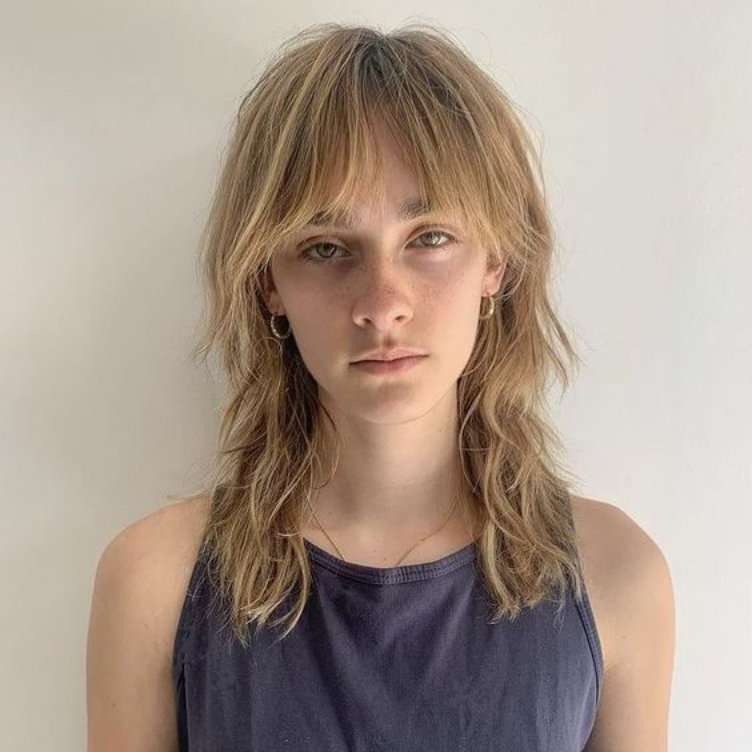

# Información sobre Camille Jansen



## Datos Personales

- **Nombre:** Camille Jansen
- **Nacionalidad:** Francesa
- **Edad:** [24 anios]

## Trayectoria Profesional

Camille Jansen es una reconocida modelo francesa conocida por su elegancia, versatilidad y presencia en las pasarelas internacionales.

### Carrera

Comenzó su carrera en el mundo del modelaje a una edad temprana y rápidamente se destacó por su belleza clásica y su capacidad para adaptarse a diferentes estilos y tendencias.

### Logros Destacados

Camille ha trabajado con algunas de las marcas más prestigiosas en la industria de la moda, incluyendo:

- **[Nombre de la marca 1]**
- **[Nombre de la marca 2]**
- **[Nombre de la marca 3]**

Su versatilidad le ha permitido participar en desfiles de moda, campañas publicitarias y editoriales de revistas de renombre internacional.

### Estilo y Reconocimiento

Su elegancia natural y su habilidad para encarnar distintos estilos le han otorgado reconocimiento en la industria de la moda, convirtiéndola en una figura influyente y respetada.

## Redes Sociales

¡Sigue a Camille Jansen en sus redes sociales para estar al tanto de sus proyectos y su vida personal!

- **Instagram:** [@camillejansen](https://www.instagram.com/camillejansen/)
- **Twitter:** [@camillejansen](https://twitter.com/camillejansen)


````Esto es un párrafo de código.````


---

Este documento ha sido creado para proporcionar información básica sobre la modelo francesa Camille Jansen. ¡No dudes en seguir sus redes para conocer más sobre su carrera y proyectos actuales!
